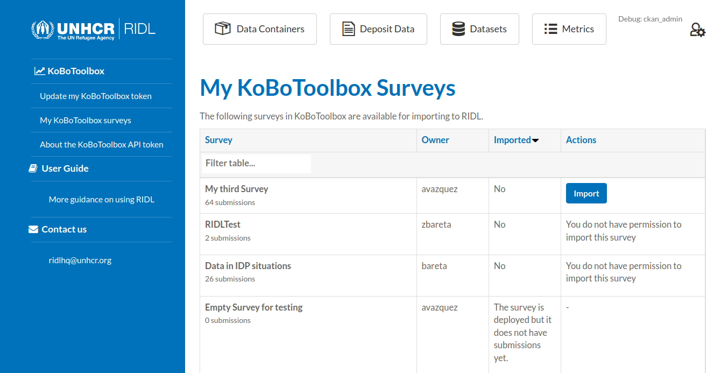
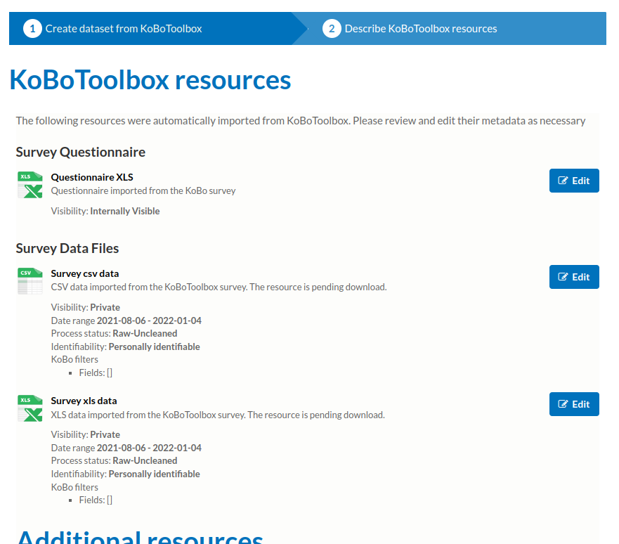

# KoBo on RIDL

## End user documentation

If you a are a user with permission on (at least) one Data Container you
will be able to create new datasets importing your surveys from KoBoToolbox.  

To connect your RIDL account with your KoBoToolbox account you can go to your dashboard ...  

 ... or to your user page.  

You will need your KoBo _token_. You can get it
following [this KoBoToolbox tutorial](https://support.kobotoolbox.org/api.html).  

Once you set up your KoBo token you will see a list of all
the KoBoToolbox surveys that you have access to.  

Some Surveys may not have been _deployed_ or have already been
imported (and you cannot import a survey twice).  
The _Import_ button will show you which surveys are ready to import.  

Once you start the import process you will see the regular _new dataset_ form
but some field will be preloaded. The _Original ID_ field will be filled with
the KoBoToolbox ID for this survey.  

After filling all the required fields and continue to next step you will
automatically see some resources (dependineg on which format you select on previous step).  

The actual data download process happens in the background.  
Until the data is downloaded, you will see the legend _"The resource is pending download."_
for each resource.  

You can edit any of these resources at the metadata level but you can't change
the data files.  

That's it. You now have your KoBoToolbox datasets ready to go just like any other dataset in RIDL.  
